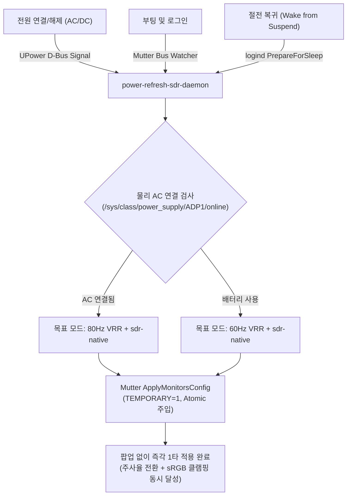

# power_refresh_sdr.sh 설명 문서

이 문서는 **[`power_refresh_sdr.sh`](./power_refresh_sdr.sh)** 스크립트가 적용하는 전원 상태 연동 주사율 자동 전환 및 `sdr-native`(sRGB 클램핑) 자동 주입 패치의 배경, 동작 원리, 구성 파일 및 롤백 방법을 상세히 설명합니다.

---

## 1. 배경 및 해결하려는 문제

갤럭시 북4 프로(Galaxy Book 4 Pro, NT960XGK 16인치, Samsung AMOLED 패널)에서 우분투를 사용할 때 다음과 같은 전원, 주사율 및 디스플레이 색역 관리의 복합적인 문제가 발생합니다:

### (1) 배터리 수명과 화면 부드러움 간의 수동 전환 불편
- 충전기(AC)가 연결되어 있을 때는 부드러운 화면과 저발열의 균형점인 **80Hz VRR**이 이상적입니다.
- 외부에서 배터리(DC)로 구동할 때는 고해상도(2880×1800) OLED 패널의 전력 소비를 줄이기 위해 **60Hz VRR**로 낮추는 것이 배터리 지속 시간에 매우 유리합니다.
- 그러나 사용자가 전원선을 꽂거나 뺄 때마다 우분투 설정 앱에 들어가 수동으로 주사율을 변경하는 것은 매우 번거롭습니다.

### (2) OLED 광색역(DCI-P3) 과포화 및 주사율 변경 시 `sdr-native` 해제 문제
- 갤럭시 북4 프로의 AMOLED 패널은 DCI-P3 120%+ 광색역 패널입니다. 별도의 색역 제한(Clamping)이 없으면 웹 브라우저, 동영상, 텍스트 등 일반적인 sRGB 콘텐츠의 색상이 과도하게 번지거나 붉게 왜곡되는 과포화(Oversaturation) 현상이 발생합니다.
- GNOME Wayland(Mutter) 컴포지터는 `color-mode` 속성을 통해 sRGB로 색역을 클램핑하는 `sdr-native`(내부 모드 값 2) 기능을 제공합니다.
- **치명적인 버그/한계**: 우분투 기본 GNOME 환경에서는 **주사율을 변경하거나, 시스템 부팅 직후, 또는 화면 잠금/절전(Suspend) 후 복귀(Resume)할 때마다 `sdr-native` 설정이 풀려 기본 P3 광색역으로 강제 리셋**되는 문제가 있습니다.

### (3) 기존 확장 프로그램 및 udev 룰 방식의 한계와 부작용
- **GNOME 확장 프로그램(Refresh Rate Governor 등)**:
  - 주사율 변경 기능만 지원하며 색역(sdr-native) 관리는 지원하지 않음.
  - 외부 스크립트와 함께 구동 시 타이밍 충돌(Race Condition)로 인해 주사율이나 색역 둘 중 하나가 누락됨.
- **단순 udev 룰 방식**:
  - udev는 root 권한으로 실행되므로 Wayland 사용자 세션 버스(D-Bus)에 접근하기 위해 복잡한 환경 변수 우회가 필요함.
  - USB 포트 등의 연결 이벤트까지 무차별적으로 감지할 경우 Suspend/Wake 시 I/O 병목이나 멈춤 현상 유발.
- **GNOME 확인 다이얼로그 팝업 방해**:
  - 일반적인 디스플레이 변경 API나 단축 명령을 쓰면 화면 중앙에 "이 설정을 유지하시겠습니까? (20초 후 되돌림)" 팝업이 발생하여 사용자 작업을 방해함.
- **80% 배터리 보호 충전 모드 오작동**:
  - 삼성 배터리 수명 보호(80% 충전 제한)가 활성화되어 있으면, AC 어댑터가 꽂혀 있어도 배터리 상태는 '충전 중(Charging)'이 아니라 '유휴/완충'으로 표시되어 배터리 모드로 오인되는 문제 발생.

---

## 2. 적용되는 설정 및 시스템 경로

이 스크립트는 다음 위치에 데몬 스크립트 및 systemd 사용자 서비스를 배치합니다:

| 대상 경로 | 설명 | 원본 파일 위치 |
| :--- | :--- | :--- |
| `~/.local/bin/power-refresh-sdr-daemon.py` | UPower/Mutter D-Bus 감시 및 무음 디스플레이 전환 데몬 | [`configs/bin/power-refresh-sdr-daemon.py`](./configs/bin/power-refresh-sdr-daemon.py) |
| `~/.config/systemd/user/power-refresh-sdr.service` | 로그인/그래픽 세션 시작 시 데몬 자동 실행 systemd 서비스 | [`configs/systemd-user/power-refresh-sdr.service`](./configs/systemd-user/power-refresh-sdr.service) |

---

## 3. 핵심 파라미터 및 동작 원리



### (1) 물리적 AC 연결 상태 직접 검사 (`is_ac_connected`)
- 삼성 노트북 AC 어댑터의 물리 하드웨어 상태 노드인 `/sys/class/power_supply/ADP1/online` (및 보조 USB-C 공급 노드)을 우선 검사합니다.
- 배터리 보호 기능으로 인해 충전이 80%에서 멈춰 있더라도 `online == 1`을 정확히 인식하여 80Hz VRR 고성능 모드를 안정적으로 유지합니다.

### (2) Mutter D-Bus API 무음 원자적(Atomic) 적용
- GNOME Shell 컴포지터의 내부 인터페이스인 `org.gnome.Mutter.DisplayConfig`의 `ApplyMonitorsConfig` 메소드를 직접 호출합니다.
- **`method = 1` (`TEMPORARY`) 플래그 사용**:
  - 일반 설정 변경(`PERSISTENT`) 시 나타나는 **"Keep these display settings?" 팝업 다이얼로그가 전혀 뜨지 않습니다.**
  - 무음(Silent)으로 백그라운드에서 매끄럽게 화면 모드가 전환됩니다.
- **주사율과 sdr-native의 1타 동시 주입**:
  - 주사율 변경 요청 패킷 내 모니터 속성에 `"color-mode": GLib.Variant("u", 2)` (`sdr-native`)를 함께 묶어서 전송합니다.
  - 주사율이 변경된 직후 sRGB가 풀려버리는 타이밍 이슈(Race condition)를 구조적으로 원천 차단합니다.

### (3) 완전한 이벤트 드리븐 (Event-driven) 아키텍처 (CPU 점유율 0%)
- 주기적으로 루프를 돌며 상태를 폴링(Polling)하지 않습니다.
- D-Bus 신호 수신 시에만 즉시 깨어나 처리합니다:
  1. `org.freedesktop.UPower`의 `PropertiesChanged`: 충전기 꽂음/뽑힘 즉각 반응
  2. `org.freedesktop.login1.Manager`의 `PrepareForSleep`: 노트북 덮개를 열고 절전 모드에서 깨어날 때 1초 안정화 후 자동 보정
  3. `Gio.bus_watch_name('org.gnome.Mutter.DisplayConfig')`: 부팅 및 데스크톱 로그인 직후 Mutter 컴포지터가 세션 버스에 등록되는 순간을 대기하여 초기 화면 설정 즉시 주입

---

## 4. 사전 요구사항 및 의존성

1. **디스플레이 주사율 패치 선행 권장**:
   - 80Hz 및 60Hz 주사율을 정상적으로 선택하려면 [`display_tuning.sh`](./display_tuning.sh)를 먼저 적용해 커스텀 EDID가 시스템에 등록되어 있어야 합니다.
   - (참고: 커스텀 EDID가 없는 기본 상태에서도 데몬은 오류 없이 현재 주사율을 유지하면서 `sdr-native` sRGB 클램핑 기능은 완벽하게 작동합니다.)
2. **소프트웨어 패키지**:
   - `python3`
   - `python3-gi` (GObject Introspection 라이브러리, 우분투 데스크톱 기본 포함)
3. **데스크톱 환경**:
   - Ubuntu 24.04 / 24.10 / 26.04+ (GNOME Wayland 환경)

---

## 5. 수동 확인 및 롤백 (원상 복구) 방법

### (1) 정상 동작 확인 방법

1. **서비스 동작 상태 확인**:
   ```bash
   systemctl --user status power-refresh-sdr.service
   ```
   - `Active: active (running)` 상태인지 확인합니다.

2. **실시간 전환 로그 확인**:
   ```bash
   journalctl --user -u power-refresh-sdr.service -f
   ```
   - 충전기 플러그를 꽂거나 뺄 때 아래와 같은 로그가 즉시 출력되는지 확인합니다:
     ```text
     [INFO] Applying Plugged (AC) -> 2880x1800@80.001+vrr + sdr-native [Reason: Power status changed]
     [INFO] Successfully applied 80Hz VRR + sdr-native
     [INFO] Applying Battery (DC) -> 2880x1800@60.001 + sdr-native [Reason: Power status changed]
     [INFO] Successfully applied 60Hz VRR + sdr-native
     ```

3. **현재 주사율 및 sdr-native 색역 검증**:
   ```bash
   gdctl show -v | grep -E "color-mode|refresh-rate-mode|rate"
   ```
   - `color-mode ⇒ sdr-native`가 항상 켜져 있는지 확인합니다.

---

### (2) 원클릭 롤백 (원상 복구)

언제든지 설정을 제거하고 이전 상태로 되돌리려면 아래 명령을 실행합니다:

```bash
./power_refresh_sdr.sh --restore
```
또는:
```bash
./scripts/restore-power-refresh-sdr.sh
```

- `power-refresh-sdr.service`가 중지 및 비활성화되고, 등록된 유닛 파일과 스크립트가 완전히 제거됩니다.
